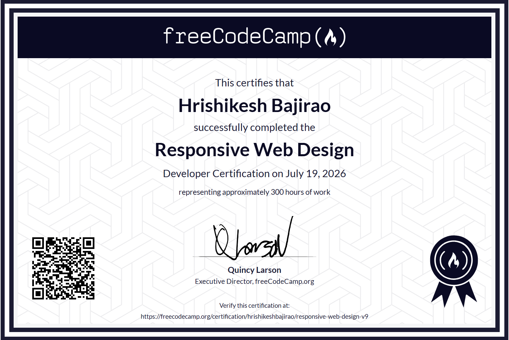

# freeCodeCamp - Responsive Web Design Certification

## [Certification](https://freecodecamp.org/certification/hrishikeshbajirao/responsive-web-design-v9)
[View Original](https://freecodecamp.org/certification/hrishikeshbajirao/responsive-web-design-v9)

**What I learned in this certification:**

- **Semantic HTML** – structuring pages with meaningful elements for better readability and accessibility.  
- **CSS fundamentals** – working with selectors, the box model, typography, colors, and spacing.  
- **Flexbox** – building flexible, one‑dimensional layouts that adapt to different screen sizes.  
- **CSS Grid** – creating complex, two‑dimensional page layouts with precise control over rows and columns.  
- **Responsive design with media queries** – making layouts that look good on mobile, tablet, and desktop.  
- **Accessibility best practices** – using proper semantics, labels, and focus order to improve UX for everyone.  
- **Forms and UI structure** – designing and styling forms and page sections that are consistent and user‑friendly.

## Certification Self Projects
1.  [Survey Form](https://github.com/HrishikeshBajirao/freeCodeCamp-Responsive-Web-Design-Certification/tree/main/1-%20Survey%20Form)
2.  [Tribute Page](https://github.com/HrishikeshBajirao/freeCodeCamp-Responsive-Web-Design-Certification/tree/main/2-%20Tribute%20Page)
3.  [Technical Documentation Page](https://github.com/HrishikeshBajirao/freeCodeCamp-Responsive-Web-Design-Certification/tree/main/3%20-%20Technical%20Documentation%20Page)
4.  [Product Landing Page](https://github.com/HrishikeshBajirao/freeCodeCamp-Responsive-Web-Design-Certification/tree/main/4%20-%20Product%20Landing%20Page)
5.  Personal Portfolio Page
### [Guided Practice Projects (15)](https://github.com/HrishikeshBajirao/freeCodeCamp-Responsive-Web-Design-Certification/tree/main/Practice%20Projects) -  **Format : name of the project ( concept that the project is based on )**

1. Cat Photo App (HTML)
2. Cafe Menu (Basic CSS)
3. Colored Markers (CSS Colors)
4. Registration Forms (HTML Forms)
5. Rothko Painting (CSS Box Model)
6. Photo Gallery (CSS Flecbox)
7. Nutrition Label (Typography)
8. Building a Quiz (Learn Accessibility)
9. Balance Sheet (CSS Pseudo Selectors)
10. Cat Painting (Intermediate CSS)
11. Building a Piano image (Responsive Web Design)
12. City Skyline (CSS Variables)
13. Magazine (CSS Grid)
14. Ferris Wheel (CSS Animation)
15. Penguin (CSS Transforms).
